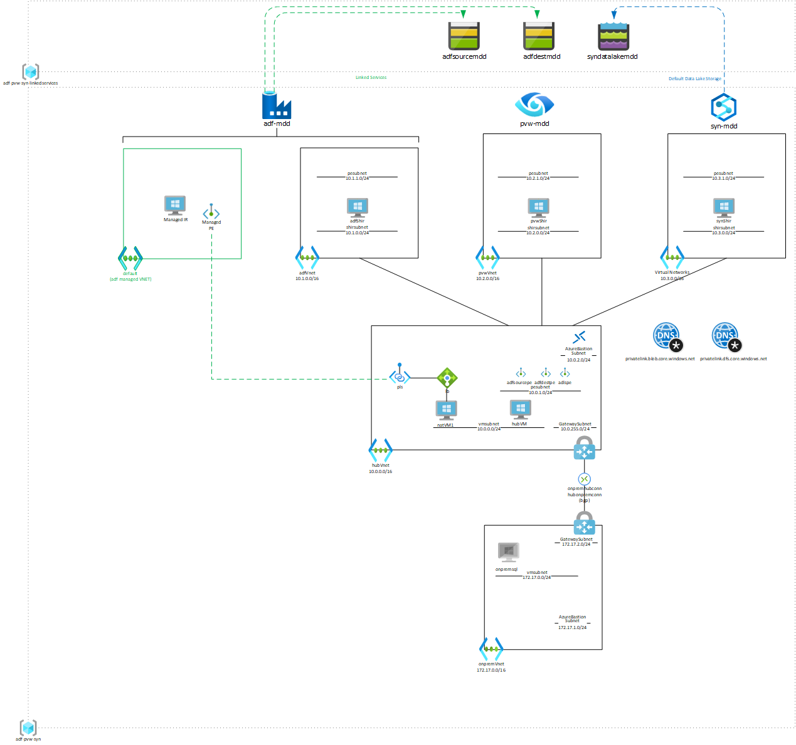

# Adf-Purview-Synapse Lab

A lab environment for network experimentation with Azure Data Factory, Purview and Synapse.



## Deployment
Log in to Azure Cloud Shell at https://shell.azure.com/ and select Bash.

Ensure Azure CLI and extensions are up to date:
  
`az upgrade --yes`
  
If necessary select your target subscription:
  
`az account set --subscription <Name or ID of subscription>`
  
Clone the  GitHub repository:
  
`git clone https://github.com/mddazure/adf-purview-synapse-lab`
  
Change directory:
  
`cd ./adf-purview-synapse-lab`

Deploy the bicep template:

`az deployment sub create --name lab --location westeurope --template-file main.bicep`


## Components

All components are deployed in a single Resource Group named *adf-pvw-syn*.

The lab assumes that the RG *adf-pvw-syn-linkedservices*, with storage accounts as shown, is already in place.

### Data services
The template creates ADF, Purview and Synapse accounts. Public Network Access is set to Enabled, so that the Studio portal of each is publically accessible.

The template provisions Self-hosted Integration Runtimes in the ADF and Synapse accounts. Purview does not have the capability to provision Self-hosted Integration Runtimes via code.

The ADF account has Linked Services to the storage accounts in the *adf-pvw-syn-linkedservices* RG, the Synapse account has a Default Data Lake Storage link to the data lake account.

### VNETs with Self-hosted runtime VMs
The template deploys VNETs containing the adfShir, pvwShir and synShir VMs respectively. 

The VMs are created from an image that already contains the Self-hosted Integration Runtime executable. The image is stored in an Image Gallery which cannot be shared generally; please contact me if you want to use this image. Alternatively, modify the shirVnets.bicep and hubVnet.bicep template files to use a standard Marketplace image and install the [Self-hosted Integration Runtime](https://www.microsoft.com/en-us/download/details.aspx?id=39717) manually.

Each of the Shir VMs needs to be configured to connect to its respective service, per the documentation for [ADF](https://docs.microsoft.com/en-us/azure/data-factory/create-self-hosted-integration-runtime?tabs=data-factory#create-a-self-hosted-ir-via-ui), [Purview](https://docs.microsoft.com/en-us/azure/purview/manage-integration-runtimes) and [Synapse]().

VM Credentials:

adminUsername = AzureAdmin

adminPassword = Adfpvwsyn-21

### Hub VNET
The Hub VNET is peered with each of the Shir VNETs. It contains a central Bastion instance, a VM (credentials above) and a VNET Gateway with OpenVPN P2S configuration.

The Hub VNET contains Private Endpoints connected to the blob storage and data lake accounts. Private DNS zones contain A records for the PEs and are linked to the Hub VNET and the Shir VNETs. 

The lab deployment configured the data services for public access. When they are reconfigured for private access, a P2S VPN connection can be used to connect via Private Endpoints. 

Connecting to Private Endpoints requires DNS resolution. The hub VNET is set to use the hub VM as its DNS, and the hub VM is configured as a DNS forwarder to the Azure VNET resolver at 168.63.129.16. 

The Hub VNET VPN Gateway is configured for OpenVPN with certicate authentication. Install the Azure VPN Client and modify the configuration for DNS resolution vua the hub VM as follows:
- Download and extract the VPN client file from the portal
- Install the Azure VPN client from the Microsoft Store
- Browse to the extracted Azure VPN Client folder and open the azurevpnconfig.xml file in an editor such as Visual Studio Code or Notepad++
- Modify the file by inserting below lines, just below line 21 `</dnsservers>`
``` 
    <dnssuffixes>
      <dnssuffix>.</dnssuffix>
    </dnssuffixes> 
```
- In the Azure VPN Client, click on the '+' in the lower left corner, and select the azurevpnconfig.xml just modified
- Install the certificate by double clicking and accepting the wizard defaults. The private key password is 'Nienke04'.
- In the Azure VPN Client, click Connect.


 


